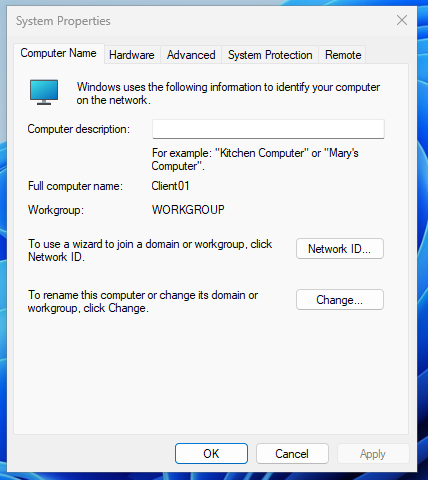
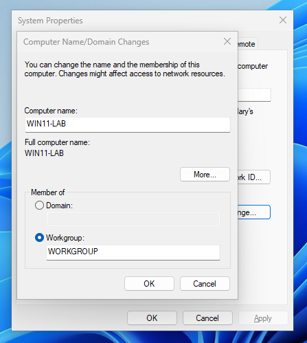
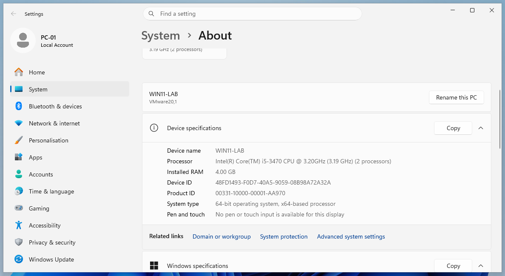

# Windows 11 System Administration Lab

## 📌 Project Overview

This project documents a hands-on Windows 11 system administration lab performed in a virtual environment. The lab focuses on common administrative, troubleshooting, and validation tasks used in IT Support and System Administration roles.

The project includes computer configuration, local user and group management, NTFS permissions, Windows Update verification, Windows Security checks, firewall configuration, service management, performance monitoring, Event Viewer analysis, disk management, and network verification.

---

## 🎯 Project Objectives

- Rename and verify the Windows client computer.
- Create and manage local user accounts.
- Assign local administrative privileges.
- Verify users with Command Prompt and PowerShell.
- Configure NTFS permissions for shared folders.
- Test read-only and modify access.
- Check Windows Update and update history.
- Review hardware detection in Device Manager.
- Validate Windows Security and Defender status.
- Inspect firewall profiles and create firewall rules.
- Manage services through GUI and PowerShell.
- Monitor system performance using Task Manager.
- Review Event Viewer logs and create a test event.
- Add, initialize, and configure a second disk.
- Verify disks and volumes with PowerShell.
- Verify TCP/IP configuration using `ipconfig /all`.

---

## 🛠️ Lab Environment

| Component | Details |
|---|---|
| Operating System | Windows 11 Pro |
| Virtualization Platform | VMware Workstation |
| System Type | x64-based virtual machine |
| Administration Tools | Computer Management, lusrmgr.msc, PowerShell, CMD |
| Security Tools | Windows Security, Microsoft Defender, Windows Firewall |
| Monitoring Tools | Task Manager, Event Viewer |
| Storage Tools | Disk Management, PowerShell |
| Network Tools | ipconfig /all |

---

# Part 1 — Computer Configuration

## Step 1: Check Current Computer Name

I first reviewed the current computer name before making any configuration changes.



## Step 2: Rename the Computer

I renamed the Windows 11 client computer to use a clearer administrative naming format.



## Step 3: Verify the New Computer Name

After renaming, I confirmed that the updated computer name was applied successfully.



---

# Part 2 — Local Users and Groups Management

## Step 4: Open Local Users and Groups

I opened the Local Users and Groups console to manage local accounts.


## Step 5: Create the Helpdesk User

I created a local standard support account named **helpdesk-user**.


## Step 6: Review Local User Console

I reviewed the Users console to verify the new account.


## Step 7: Create the IT Admin User

I created another local account named **it-admin** for administrative tasks.


## Step 8: Verify Created Users

I confirmed that both local users were created successfully.


## Step 9: Review Administrators Group

I checked the local **Administrators** group before adding the new admin user.


## Step 10: Add IT Admin to Administrators Group

I added **it-admin** to the local Administrators group.


## Step 11: Verify Users with Command Prompt

I used the `net users` command to list local accounts.


## Step 12: Review Helpdesk User Details

I checked the account configuration for the helpdesk user.


## Step 13: Verify Accounts with PowerShell

I used `Get-LocalUser` to verify local user information.


## Step 14: Verify Administrator Membership in PowerShell

I validated administrative group membership using PowerShell.


---

# Part 3 — NTFS Permissions Lab

## Step 15: Create the Shared Data Folder

I created a shared working folder to test NTFS access control.


## Step 16: Review Original Permissions

I reviewed the default permissions on the folder before making changes.


## Step 17: Add Helpdesk User with Read-Only Access

I assigned the helpdesk account limited read-only access.


## Step 18: Test Helpdesk Login

I signed in as the helpdesk user to test access.


## Step 19: Review NTFS Permissions Before Fix

I reviewed the permissions again to troubleshoot or refine access.


## Step 20: Configure Custom NTFS Permissions

I adjusted permissions using custom NTFS settings.


## Step 21: Validate Restricted Save Access

I confirmed that the helpdesk user was restricted from saving where modify access was not allowed.


## Step 22: Validate IT Admin Modify Access

I verified that the IT admin account was able to modify files successfully.


## Step 23: Re-test Helpdesk Access

I performed an overwrite or write test again with the helpdesk user.


## Step 24: Sign in as IT Admin

I logged in again with the administrative account for final verification.


## Step 25: Final NTFS Permission Verification

I confirmed the final access configuration.


---

# Part 4 — Windows Update

## Step 26: Check Windows Update Status

I checked for updates and confirmed update completion.


## Step 27: Review Quality Update History

I reviewed recently installed quality updates.


## Step 28: Review Driver Update History

I reviewed installed driver updates.


---

# Part 5 — Device Manager and Windows Security

## Step 29: Open Device Manager

I opened Device Manager to inspect installed hardware.


## Step 30: Review Device Manager Overview

I verified that virtual hardware was detected correctly.


## Step 31: Review Windows Security Dashboard

I checked the overall Windows Security status.


## Step 32: Run Defender Quick Scan

I reviewed the results of a quick malware scan.


## Step 33: Verify Defender Status in PowerShell

I validated Windows Defender information using PowerShell.


---

# Part 6 — Windows Firewall Management

## Step 34: Review Firewall Network Profiles

I opened Windows Firewall settings and reviewed the active network protection profiles.


## Step 35: Verify Firewall Profiles in PowerShell

I used PowerShell to validate firewall profile status.


## Step 36: Create a Firewall Rule

I created a test or administrative firewall rule.


## Step 37: Verify the Firewall Rule

I checked that the rule was created successfully.


## Step 38: Review Firewall Rule in GUI

I confirmed the rule in the graphical firewall console.


---

# Part 7 — Services Management

## Step 39: Open the Services Console

I opened the Windows Services management console.


## Step 40: Review Windows Search Service Properties

I examined the properties of the Windows Search service.


## Step 41: Stop the Windows Search Service

I stopped the service to validate service management behavior.


## Step 42: Verify Service State in PowerShell

I used PowerShell to confirm the service state.


---

# Part 8 — Performance Monitoring with Task Manager

## Step 43: Review Running Processes

I inspected running processes in Task Manager.


## Step 44: Review CPU Usage

I monitored CPU utilization.


## Step 45: Review Memory Usage

I monitored memory usage.


## Step 46: Review Network Usage

I monitored network usage in Task Manager.


---

# Part 9 — Event Viewer

## Step 47: Open Event Viewer

I opened Event Viewer to inspect Windows logs.


## Step 48: Review System Event Logs

I reviewed system log entries.


## Step 49: Review Event Details

I opened an event entry to inspect detailed information.


## Step 50: Review Errors and Warnings

I reviewed warning and error entries for troubleshooting practice.


## Step 51: Create a Test Event

I generated a custom or test event.


## Step 52: Verify the Custom Event

I checked that the test event appeared correctly.


## Step 53: Verify Event Log in PowerShell

I used PowerShell to confirm event log data.


---

# Part 10 — Disk Management

## Step 54: Add a Second Virtual Disk

I added a second disk to the virtual machine through VMware settings.


## Step 55: Detect New Disk

I verified that the new disk appeared as uninitialized.


## Step 56: Initialize Disk as GPT

I initialized the disk using GPT partition style.


## Step 57: Complete Disk Configuration

I created and configured the new volume in Disk Management.


## Step 58: Verify New Drive in File Explorer

I confirmed that the new drive was available in File Explorer.


## Step 59: Verify Disks with PowerShell

I used `Get-Disk` to validate the disk configuration.


## Step 60: Verify Volumes with PowerShell

I used `Get-Volume` to verify the volume configuration.


---

# Part 11 — Network Verification

## Step 61: Verify TCP/IP Configuration

I used:

```cmd
ipconfig /all
```

to review the full network configuration.


This helped verify:

- IPv4 addressing
- DHCP status
- DNS server configuration
- Adapter details
- Gateway information

---

# 🔧 Skills Demonstrated

- Windows 11 Administration
- Local Users and Groups
- Group Membership Management
- NTFS Permissions
- Access Control Testing
- Windows Update Management
- Device Manager
- Windows Security / Microsoft Defender
- Windows Firewall
- Service Management
- Task Manager Monitoring
- Event Viewer Troubleshooting
- Disk Management
- PowerShell Administration
- Command Prompt
- Network Verification
- Virtual Machine Administration
- Troubleshooting
- Technical Documentation

---

# 📚 What I Learned

This project helped me practice real Windows administrative tasks in a structured virtual lab.

I strengthened my understanding of:

- user and privilege management
- access control and permissions
- Windows update and security validation
- firewall configuration
- service administration
- system monitoring
- event log analysis
- disk provisioning
- PowerShell-based verification
- network troubleshooting

This lab reflects practical skills used in IT Support and System Administration roles.

---

# ✅ Project Conclusion

In this project, I completed a wide range of Windows 11 administration and troubleshooting tasks in a virtual environment.

I created and validated local user accounts, configured permissions, reviewed updates and security settings, managed services and firewall rules, analyzed event logs, added storage, and verified network settings.

This project demonstrates hands-on ability in Windows system administration and provides a strong foundation for future labs involving Windows Server, Active Directory, PowerShell, and enterprise support tasks.

---

## 👤 Author

**Abhishek Kumar**  
Aspiring IT Support / System Administration Professional

`Windows | VMware | PowerShell | Networking | IT Support | System Administration`
